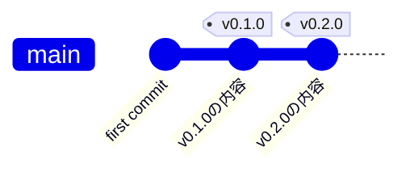
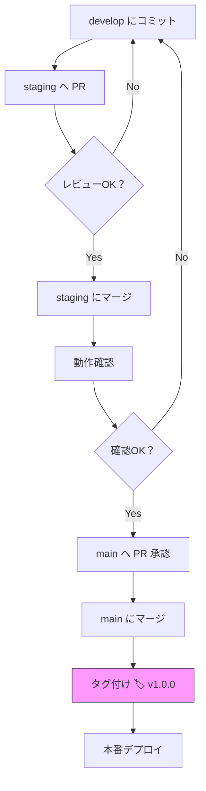

# Gitタグ付け 学習まとめ

## 全体像



---

## タグ付けのタイミング（3環境ブランチ戦略）



---

## ローカルとGitHubの関係

```mermaid
flowchart LR
    subgraph ローカル
        A[git tag -a v1.0.0] --> B[タグ作成]
        C[git tag -d v1.0.0] --> D[タグ削除]
    end

    subgraph GitHub
        E[タグ表示される]
        F[タグ削除される]
    end

    B -- git push origin v1.0.0 --> E
    D -- git push origin --delete v1.0.0 --> F
```

---

## タグとは何か

タグは「特定のコミットへの永続的な名前札」。

- ブランチ → 動く（コミットが積まれるたびに先端が移動する）
- タグ → 動かない（常に同じコミットを指す）

タグはブランチに付くのではなく、**コミットに付く**。
`git checkout v1.0.0` は「v1.0.0タグが指すコミットに移動する」であり、ブランチへの移動ではないため `detached HEAD` 状態になる。

---

## タグの2種類

| 種類 | コマンド | 記録される情報 | 用途 |
|------|---------|--------------|------|
| 軽量タグ | `git tag v1.0.0` | コミットへのポインタのみ | 一時的な目印 |
| 注釈付きタグ | `git tag -a v1.0.0 -m "メッセージ"` | 作成者・日時・メッセージも記録 | リリース用（推奨） |

`-a` = annotated（注釈付き）、`-m` = message（メッセージ）

---

## 基本コマンド

```bash
# タグを作る（注釈付き）
git tag -a v1.0.0 -m "メッセージ"

# タグ一覧を見る
git tag

# タグの詳細を見る
git show v1.0.0

# GitHubへコミットを送る
git push origin main

# GitHubへタグを送る（タグは別途pushが必要）
git push origin v1.0.0

# 過去のタグの状態に戻る
git checkout v1.0.0

# mainに戻る
git checkout main

# ローカルのタグを削除
git tag -d v1.0.0

# GitHubのタグを削除
git push origin --delete v1.0.0
```

---

## 重要なポイント

### コミットとタグは別々にpushする
`git push` だけではタグはGitHubに送られない。タグは `git push origin v1.0.0` で別途送る必要がある。

### 同じ名前のタグは1つだけ
同じリポジトリ内で同じタグ名は使えない。環境ごとにタグを付けたい場合は名前を分ける。

```
v1.0.0              # mainの正式タグ
deploy/stg/v1.0.0   # stagingのタグ
deploy/dev/v1.0.0   # developのタグ
```

---

## タグを付けるタイミング（ブランチ戦略）

```
develop（開発環境）
    ↓ PRマージ
staging（ステージング環境）
    ↓ 動作確認OK → mainへのPR承認
main（本番環境）
    ↓
  タグ付け ← v1.0.0  ← ここが正しいタイミング
```

- タグはmainにマージされた後に付ける
- PRが承認前のコードにタグを付けない（レビューで修正が入るとタグが指すコードが「問題があった状態」になる）
- 複数のバグ修正PRがある場合、**全部マージし終わってから1回タグを付ける**

### CI/CDでの自動化（規模が大きくなったとき）
mainへのマージをトリガーに、タグ付けとデプロイを自動化するのが一般的。
